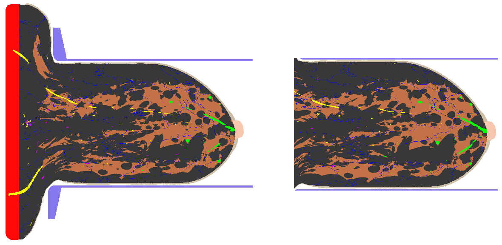

Overview
========

For efficient use of limited GPU memory during x-ray particle transport with MC-GPU, an x-ray photon transport code which is also part of the VICTRE package, this code
crops out parts of the phantom that are not directly in the path of the x-ray source between the compression surfaces.  It also can uniformly crop repeated realizations
of a phantom configuration file to remove slight variations in phantom size due to the effect of random internal tissue structures on the physical compression simulation.

   Cross-sectional view of uncropped (left) and cropped (right) phantom.

